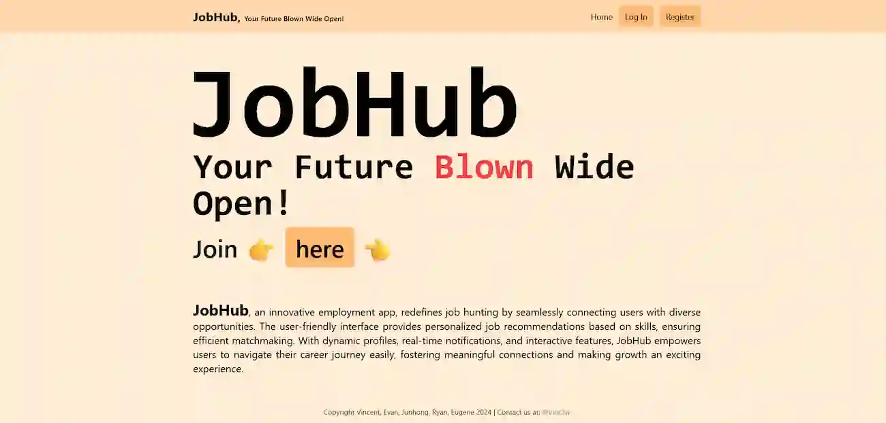

# JobHub

This is my Web Development Assignment Project to create a website with an integrated personal portfolio management system.

### Features
- Authentication (Login, Register, Forgot Password, Logout)
- Organization of portfolios (Filter, Sort, Search, Pagination)
- Admin System
- Notification System
- Profile System
- Beautiful and intuitive UI design
- MySQL implementation

### Tools used
- Php
- Composer
- PhpMailer
- Brevo
- Tailwind CSS
- Javascript
- MySQL
- XAMPP

### Contact
[Discord](https://discord.com/users/582932383381192705) 
[Instagram](https://www.instagram.com/vinc3w59)